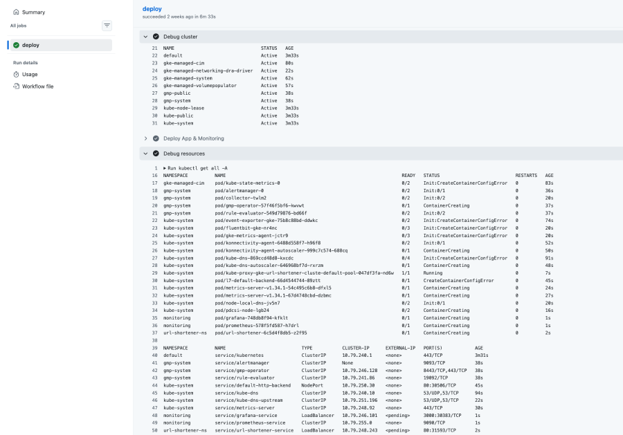
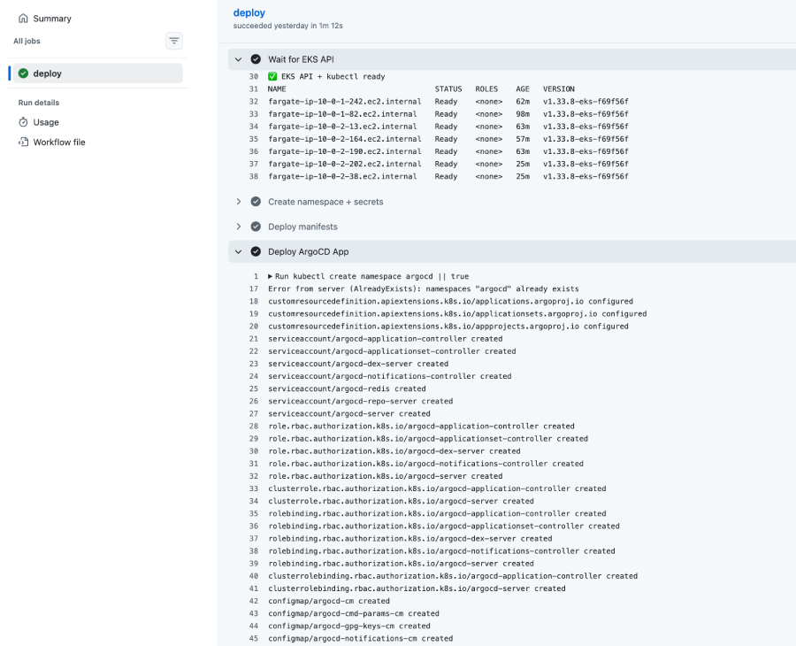
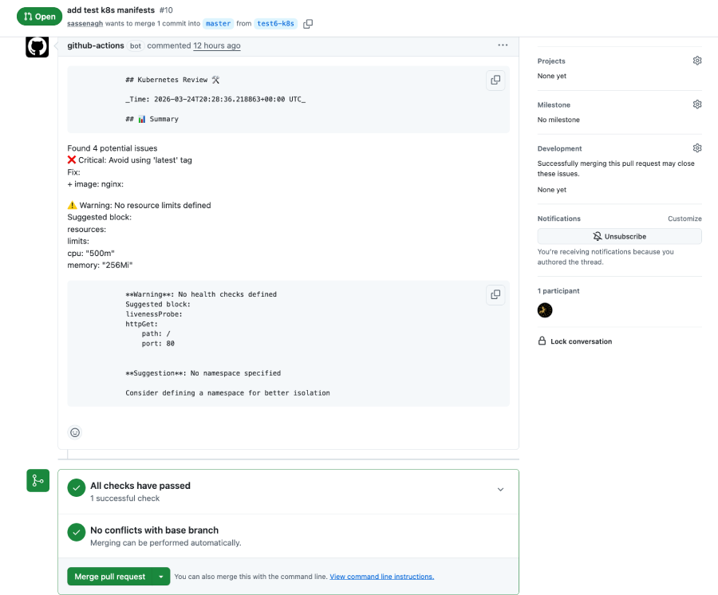

# Anna Alcaide Devops Portfolio

Welcome to my portfolio of DevOps and full-stack development projects. Here you'll find some of my featured projects with descriptions, technologies used, and screenshots of their functionality or pipelines.

---

## 1. Python URL Shortener (GCP + GKE)

- **Description:** A URL shortener built with Python and Docker, deployed on GKE. It allows you to shorten URLs and perform basic statistics tracking.
- **Features:**
  - URL shortening service
  - Containerized Python app deployed on GKE  
  - Infrastructure as Code with Terraform
  - CI/CD pipeline with GitHub Actions  
  - Monitoring with Prometheus & Grafana  
  - Exposed via LoadBalancer  
- **Technologies:** Python, Docker, Kubernetes, GCP (GKE), Cloud Run, ArgoCD.
- **Technical Decisions & Challenges:**
    Chose GKE over simpler runtimes like Cloud Run to gain full control over networking, scaling and Kubernetes-native operations.

    Integrating Terraform across infrastructure and application layers introduced challenges around state management and resource dependencies.

    Monitoring with Prometheus and Grafana was intentionally added in a later stage, once the system was stable, to enable more structured and efficient observability.
- **Repository:** [python-url-shortener](https://github.com/sassenagh/python-url-shortener)
- **Status:** Functional with automated deployment on GKE.
- **Pipeline image:** `pipeline.png` in `screenshots/python-url-shortener/`.

--

## 2. Node Image Resizer (AWS + EKS)

- **Description:** Image resizing service using Node.js. Supports image uploads and thumbnail generation.
- **Features:**
    - Upload images via REST API
    - Image resizing handled by background workers
    - Storage in AWS S3
    - GitOps deployment with Argo CD
    - Infrastructure managed with Terraform
- **Technologies:** Node.js, Express, Docker, GitHub Actions.
- **Technical Decisions & Challenges:**
    Selected EKS to work with AWS-native services like S3 while maintaining a Kubernetes-based architecture instead of serverless alternatives.

    A significant challenge was defining and managing IAM policies to allow Terraform to provision infrastructure securely without over-permissioning.

    Argo CD was introduced as a final step to implement a GitOps workflow and create a more realistic and production-like deployment setup.
- **Repository:** [node-image-resizer](https://github.com/sassenagh/node-image-resizer)
- **Status:** Functional with automated deployment on EKS.
- **Pipeline image:** `pipeline.png` in `screenshots/node-image-resizer/`.

- ---

## 3. Kubernetes AI PR Bot (k8s + AI)

- **Description:** Bot that automatically comments on pull requests using AI. Deployed on Kubernetes with CI/CD on GitHub Actions.
- **Features:**
    - Automatic review of Kubernetes PR diffs using OpenAI GPT-3.5 (optional)
    - Detection of critical issues (privileged containers, :latest images)
    - Suggestions for improvements (resource limits, health checks, namespace, deprecated APIs)
    - Fallback review if OpenAI is not configured or quota is exhausted
- **Technologies:** Python, Kubernetes, GitHub Actions, OpenAI API.
- **Technical Decisions & Challenges:**
    Built directly on Kubernetes instead of standalone scripts to simulate real-world CI/CD workflows and cluster-level validation.

    Handling optional OpenAI integration with fallbacks was challenging, especially ensuring consistent behavior without external dependencies.

    Parsing PR diffs and reliably detecting misconfigurations required careful logic to avoid false positives and noisy feedback.
- **Repository:** [k8s-ai-pr-bot](https://github.com/sassenagh/k8s-ai-pr-bot)
- **Status:** Functional, tested via pull requests.
- **Screenshot of the bot's response on PR:** `pr-response.png` in `screenshots/k8s-ai-pr-bot/`.

---

## 4. Kubernetes DevSecOps Pipeline (SAST + SCA + DAST)

- **Description:** End-to-end DevSecOps pipeline that integrates security testing across the SDLC. Builds, scans, and deploys a vulnerable application to Kubernetes while automatically detecting security issues.
- **Features:**
    - Static Application Security Testing (SAST) with Semgrep
    - Software Composition Analysis (SCA) with Trivy
    - Dynamic Application Security Testing (DAST) with OWASP ZAP
    - Docker image build and vulnerability scanning
    - Kubernetes deployment using native manifests
    - Port-forwarding for local runtime security testing
    - Automated security report generation and artifact upload
    - Intentional vulnerabilities (XSS) to demonstrate detection capabilities
- **Technologies:** Python, Docker, Kubernetes, GitHub Actions, Semgrep, Trivy, OWASP ZAP.
- **Technical Decisions & Challenges:**
    Chose a multi-tool approach (Semgrep, Trivy, OWASP ZAP) to cover different layers of security instead of relying on a single scanner.

    The main challenge was orchestrating scans efficiently in GitHub Actions without significantly increasing pipeline execution time.

    Running DAST in a local Kubernetes context required workarounds like port-forwarding and careful environment setup.
- **Repository:** [k8s-devsecops-pipeline](https://github.com/sassenagh/k8s-devsecops-pipeline)
- **Status:** Functional, fully integrated DevSecOps pipeline with security scanning.
- **Screenshot of the security report:** `pipeline.png` in `screenshots/k8s-devsecops-pipeline/`.

---

## Tech Stack

- **Cloud**: GCP, AWS  
- **Containers**: Docker, Kubernetes  
- **Infrastructure as Code**: Terraform  
- **CI/CD**: GitHub Actions  
- **Security**: Semgrep, Trivy, OWASP ZAP
- **Monitoring**: Prometheus, Grafana  
- **Languages**: Python, Node.js  

---

## Overview

This portfolio reflects practical experience building and deploying cloud-native applications with a strong DevOps focus.

---

## About Me

DevOps and Infrastructure Engineer with a solid foundation in software engineering.

Experienced in building and operating cloud-native systems with Docker, Kubernetes and cloud platforms like GCP and AWS, focusing on scalability, resilience and automation.

I bring a development-driven approach to infrastructure, prioritizing clean design, efficiency and long-term maintainability.

---

## Contact

- **GitHub:** [https://github.com/sassenagh](https://github.com/sassenagh)
- **LinkedIn:** [https://www.linkedin.com/in/anaalcaideh](https://www.linkedin.com/in/anaalcaideh)

---

**Notes:**

- All screenshots are in the `screenshots/` folder, organized by project.
- Each project includes badges and links to its original repository.